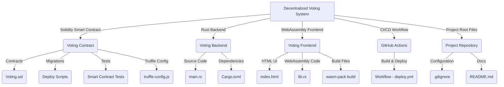

# decentralized-voting
🗳️ Decentralized Voting System A blockchain-based voting system using Solidity (Ethereum Smart Contract), Rust (Backend API), and WebAssembly (Frontend UI) for secure and transparent voting.  🔹 Features: ✅ Smart contract on Ethereum (Ganache) ✅ Rust backend with Web3 integration ✅ WebAssembly frontend for voting UI

# 🗳️ Decentralized Voting System

A **secure and transparent blockchain-based voting system** built using **Solidity (Smart Contract)**, **Rust (Backend API)**, and **WebAssembly (Frontend UI)**.

🚀 **Live Demo**: [Coming Soon]  

---

## 📌 **Features**
✅ **Blockchain-Based** – Secure voting using Ethereum  
✅ **Decentralized** – No central authority control  
✅ **Rust Backend** – High-performance API  
✅ **WebAssembly Frontend** – Fast & lightweight UI  
✅ **Real-Time Updates** – Instant voting results  

---

## 🏗️ **Project Structure**

---

## 🛠️ **Setup Instructions**
### 🔹 **Prerequisites**
Before starting, ensure you have installed:
- **Node.js & npm**  
- **Truffle & Ganache**  
- **Rust & Cargo**  
- **wasm-pack** (for WebAssembly)

### 🔹 **Clone the Repository**
git clone https://github.com/Omi201/decentralized-voting.git
cd decentralized-voting

###🔹 **Install Dependencies**

cd voting-contract
npm install

###🔹 **Compile & Deploy the Smart Contracts**
truffle compile
truffle migrate --reset

###🔹 **Run the Rust Backend**
cd ../voting-backend
cargo run

###🔹 **Start the WebAssembly Frontend**
cd ../voting-frontend
python3 -m http.server

🚀 Go to: http://127.0.0.1:8000

🖥️ Usage & Expected Outputs
Rust Backend Output:
✅ Total Candidates: 2
Frontend UI
-Users can vote for candidates.
-Votes update in real-time.

🛠️ CI/CD - Continuous Integration
GitHub Actions ensures that the project remains error-free before deployment.

🚀 Automated Checks:

✅ Solidity Smart Contract Compilation
✅ Rust Backend Tests
✅ WebAssembly Frontend Build
✅ Deployment Verification

🤝 Contributing
We welcome contributions! Follow these steps:

1. Fork the repository
2. Create a new branch (feature-xyz)
3. Make changes and commit
4. Submit a pull request (PR)

📜 License
This project is open-source under the MIT License.

🌟 Star the Repo
If you found this useful, please give it a star ⭐ on GitHub!

🔗 GitHub Repository: [https://github.com/omi201/decentralized-voting-]
🚀 Happy Coding!

---  

Let me know if you need any modifications! 🔥🔥🔥

